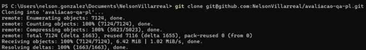
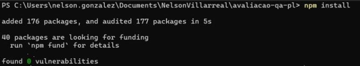
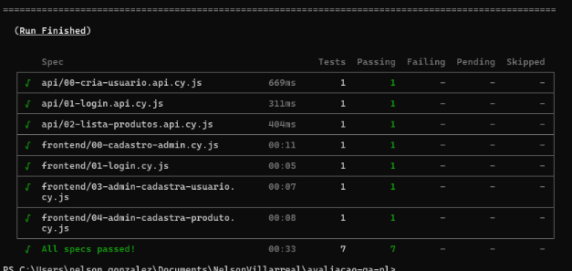

 ## Avaliação Técnica – Automação de Testes
Este projeto automatiza cenários E2E e testes de API utilizando Cypress para avaliar funcionalidades do sistema Serverest.

## Instruções para Executar os Testes
📥 1. Clonar o repositório
Clone o projeto em uma pasta de sua preferência:

```bash
git clone git@github.com:NelsonVillarreal/avaliacao-qa-pl.git
```` 


📂 2. Acesse o diretório do projeto
```bash
cd avaliacao-qa-pl
```


📦 3. Instale as dependências
Execute:

```bash
npm install
```



Esse comando irá instalar o Cypress e outras dependências definidas no package.json.

## Executar os Testes
💻 Rodar todos os testes via terminal
Execute o script abaixo para rodar todos os testes automatizados (E2E e API) em sequência:

```bash
npm run test:all
```


Os testes são executados em uma ordem lógica, considerando dependência entre fluxos (ex: login após cadastro, etc).


Resultado final apos executar "npm run test:all"

## Rodar no modo interativo (GUI do Cypress)
Se preferir executar os testes manualmente com interface visual:

```bash
npx cypress open
```
Dica: Caso não abra corretamente, verifique se o Cypress foi instalado com sucesso (node_modules presente) e se o npm install foi executado.

## Detalhes dos Testes Automatizados
### E2E (Frontend)
00-cadastro-admin.cy.js: Cadastro de admin com fallback automático

01-login.cy.js: Login de admin

03-admin-cadastra-usuario.cy.js: Cadastro de usuário comum via painel admin

04-admin-cadastra-produto.cy.js: Cadastro de produto com upload de imagem

### API (Backend)
cria-usuario.api.cy.js: Criação de usuário com dados únicos

login.api.cy.js: Login com usuário criado anteriormente

lista-produtos.api.cy.js: Listagem de produtos disponíveis

## Estrutura de Pastas
cypress/  
├── e2e/  
│   ├── api/  
│   └── frontend/  
├── fixtures/  
├── support/  
## Contato
Caso deseje falar comigo:

### [LinkedIn - Nelson Villarreal](https://www.linkedin.com/in/nelsonvillarreal/)
### 📧 devnelsonvillarreal@gmail.com

